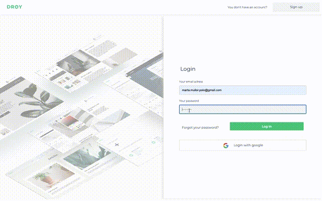

# 🛠 DROY

## What is DROY?
Online tool that allows you to build your own website without having programming knowledge.

* * *

## 👩🏻‍💻👨🏻‍💻 User Stories 

* The user can see who we are in the about page.
* The user can login or sign up with his credentials or Google.
* The user see a home page where can start a project or continue working on an existing project.
* The user can create a project and choose between two predefined themes.
* The user can delete a project.
* The user can reset his password.
* In the builder page, the user has three available modes: edit, preview and publish.
* The user can see a 404 and 5 ** controlled page.

  - **Edit Mode**:
    - The user can add a component to the user's web page, through a lateral menu that shows all the specific components             available for this theme. To include a component, the user has to add it using the + button. The component is included         in the last position.
    - The user can change the position of a component using the up / down buttons or drag an drop.
    - The user can edit the content of a component by double-clicking on the information to be updated.
    - The user can remove a component.
    - The user can save his project 
    
 
 
  - **Preview Mode**:
    - It's used so that the user can view his page without distractions.
    - Hide the side menu so you can't add new components.
    - Block all editing functionality of a component (delete, edit, change position).    
    - Links work according to the attributes that we've given them in edit mode.
    

   - **Publish Mode**:
      - The user decides to publish their website and make it visible for everybody.
      - We generate a first level url.
      - The user can share the url to their contacts and even set their own domain.
          

* * *

## 🔜 Backlog 

* The user can add a component to a specific position on their web page by drag and drop, and not by using the + button.
* The user can add more types of components such as counters, contact forms...
* User can edit more component attributes like text-color, hide / show, heading fixed...
* The user can edit their information (name, password)
* The user not only has two basic styles to choose when his create a new project.
* The tool creates responsive web pages.

* * *

## ✍🏻 Project Routes

| Routes | Description |
| -- | -- |
| /about | Page where the user can know a little bit more about our project |
| /signup | Page where the user can signup |
| /login | Page where the user can login |
| / | Displays the main page where the user can start a project. | 
| /builder/_id | It allows the user to build / edit / view / publish their website. |

* * *

## ⚡️Demo 

[A demo is worth a thousand words](https://droy-prod.web.app/about)

* * *

## Contribute

Show your ❤️ and support by giving a ⭐. 
Any suggestions are welcome!

* * *

## Links

[Link to Trello](https://trello.com/b/Krfo4Qp5/droy)

[Github](https://github.com/marcmnc7/droy)

[Presentación](https://docs.google.com/presentation/d/1uFGmgLAgxeSe85KBZDAyAb9DgJ9LqC1k4Wlm6_MQMug/edit#slide=id.p)

